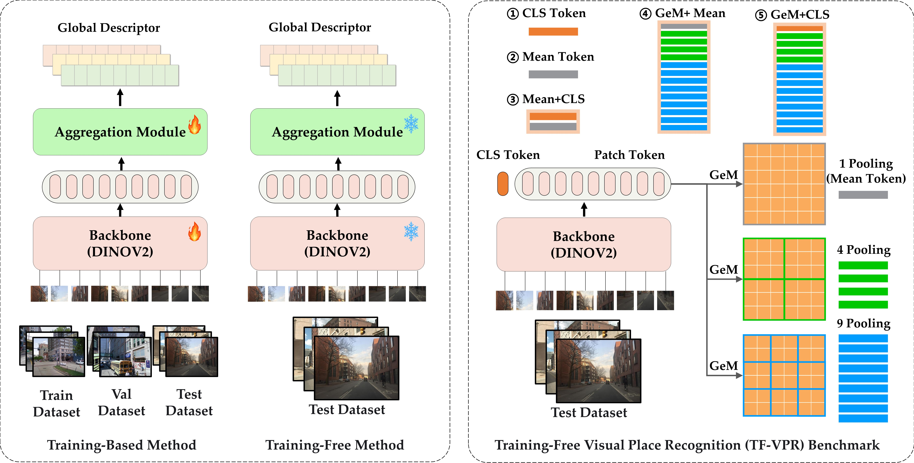
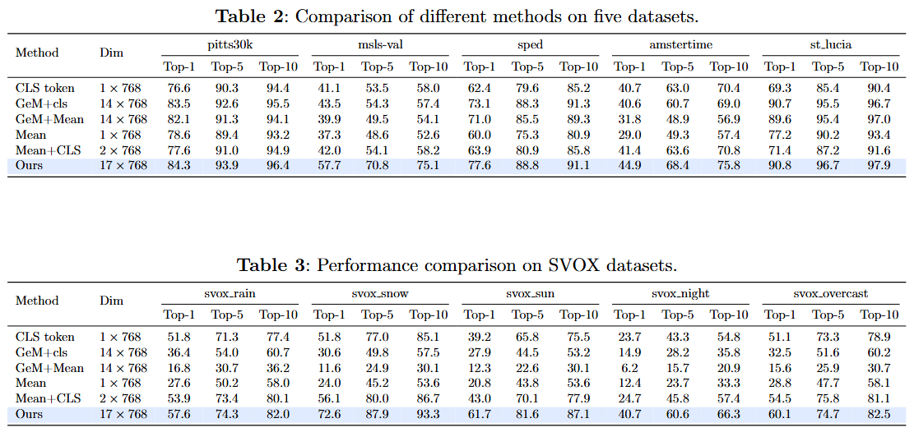

# TF-VPR
This is the official repository for the paper "TF-VPR: A Novel Benchmark for Training-Free Visual Place Recognition".



## Getting Started

This repo follows the [Visual Geo-localization Benchmark](https://github.com/gmberton/deep-visual-geo-localization-benchmark) for evaluation and refer to [VPR-datasets-downloader](https://github.com/gmberton/VPR-datasets-downloader) to prepare test datasets.

The test dataset should be organized in a directory tree as such:

```
└── datasets
    └── pitts30k
        └── images
            ├── train
            │   ├── database
            │   └── queries
            ├── val
            │   ├── database
            │   └── queries
            └── test
                ├── database
                └── queries
    └── msls
      └── images
          ├── train
          │   ├── database
          │   └── queries
          ├── val
          │   ├── database
          │   └── queries
          └── test
              ├── database
              └── queries
    ''''''
```

Before testing, you should download the pre-trained foundation model DINOv2(ViT-B/14) [HERE](https://dl.fbaipublicfiles.com/dinov2/dinov2_vitb14/dinov2_vitb14_pretrain.pth).


## TF_VPR
```
python3 eval.py --eval_dataset_name=pitts30k --backbone=dinov2 --mode TF_VPR --num_clusters=17
```

## GeM+CLS
```
python3 eval.py --eval_dataset_name=pitts30k --backbone=dinov2 --mode GeM_CLS --num_clusters=14
```

## GeM+Mean
```
python3 eval.py --eval_dataset_name=pitts30k --backbone=dinov2 --mode GeM_Mean --num_clusters=14
```

## CLS+Mean
```
python3 eval.py --eval_dataset_name=pitts30k --backbone=dinov2 --mode CLS_Mean --num_clusters=2
```

## CLS Token
```
python3 eval.py --eval_dataset_name=pitts30k --backbone=dinov2 --mode CLS --num_clusters=1
```

## Mean Token
```
python3 eval.py --eval_dataset_name=pitts30k --backbone=dinov2 --mode Mean --num_clusters=1
```


## Main Results



## Acknowledgements

Parts of this repo are inspired by the following repositories:

[Visual Geo-localization Benchmark](https://github.com/gmberton/deep-visual-geo-localization-benchmark)

[DINOv2](https://github.com/facebookresearch/dinov2)
